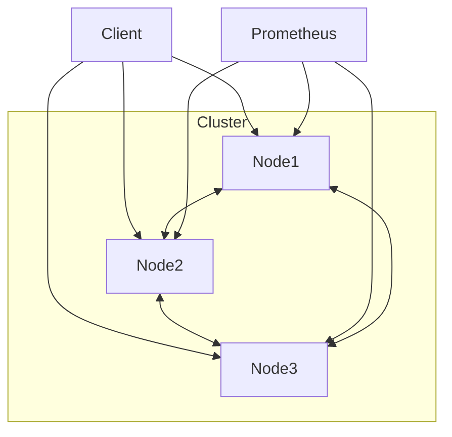

## Gambaran Umum

Sistem ini dirancang sebagai cluster node terdistribusi yang fault-tolerant, menyediakan distributed locking, antrean, dan cache terdistribusi.
## Komponen
1. API Gateway / Antarmuka Node (FastAPI): Setiap node mengekspos REST API untuk interaksi klien dan RPC antar-node.

2. Modul Konsensus (Raft & PBFT): Digunakan untuk memelihara state machine yang konsisten di seluruh node, terutama untuk Manajer Kunci Terdistribusi (Distributed Lock Manager).

3. Lock Manager: Menyediakan kunci eksklusif  dan shared locks.

4. Distributed Queue: Menggunakan Consistent Hashing untuk mempartisi antrean di seluruh cluster, untuk memastikan load balancing.

5. Cache Terdistribusi: Mengimplementasikan protokol MESI melalui jaringan untuk koherensi cache.

## Topologi Diagram
